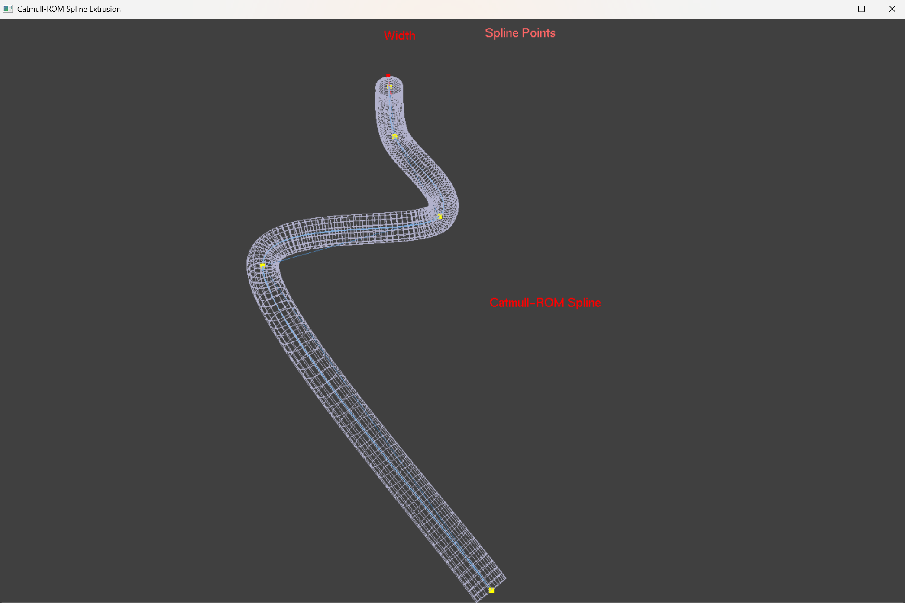

# Catmull-ROM Spline Extrusion (OpenGL, C/C++)

This sample extrudes geometry along a Catmull–Rom spline, with optional texturing, wireframe overlay, labels, and camera controls. It matches the provided assignment requirements: reads control points from a text file, accepts a PNG/JPEG texture, and extrudes at a configurable width.


## Requirements
- Windows with OpenGL
- freeglut (DLL available in the project folder)
- g++ (e.g., MinGW) or similar toolchain

## Build
From the project folder:
```
g++ main.cpp -o spline.exe -lfreeglut -lopengl32 -lglu32
```
If your freeglut headers/libs are in custom paths, add `-I`/`-L` accordingly.

## Run
```
.\spline.exe "<points.txt>" "<texture.png|jpg>" <width>
```
Examples:
```
.\spline.exe "Assignment Points.txt" "texture.png" 0.5
.\spline.exe "Assignment Points.txt" "" 0.5      (no texture; flat color)
```

## Controls
- W / S : Increase / Decrease width
- F     : Toggle wireframe
- L     : Toggle labels
- R     : Toggle auto-rotation
- Arrows: Manual rotate
- Space : Reset rotation
- ESC   : Exit

## Inputs
- Points file: CSV per line `x,y` (e.g., `Assignment Points.txt`).
- Texture: PNG/JPEG; tiled along length and around the tube.
- Width: Floating value for extrusion thickness.

## Notes
- `stb_image.h` is included for texture loading.
- Wireframe overlays help visualize the mesh; labels can be toggled off.
- Use Snipping Tool / Win+Shift+S to capture the output window for submission.

